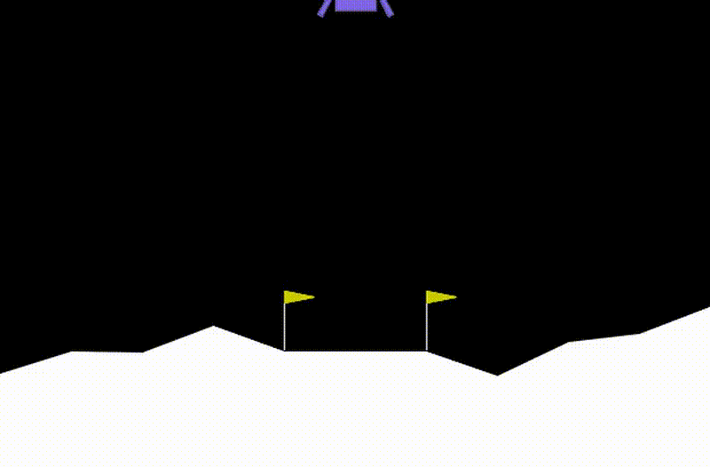

# Deep Q-Learning for Lunar Landing

This repository implements a Deep Q-Learning (DQN) agent to solve OpenAI Gym's Lunar Lander environment. The agent learns to safely land a spacecraft on the moon's surface by controlling its thrusters.

## Project Overview

The Lunar Lander task is a classic reinforcement learning problem where an agent must learn to:
- Control the main engine and side thrusters
- Manage fuel consumption
- Land safely on the designated landing pad
- Maintain proper orientation and velocity

## Implementation Details

The solution uses:
- Deep Q-Network (DQN) architecture
- Experience replay for stable learning
- Target network for reducing overestimation
- Epsilon-greedy exploration strategy

## Getting Started

The implementation is available in the Jupyter notebook: `Deep_Q_Learning_for_Lunar_Landing_Partial_Code.ipynb`

### Prerequisites
- Python 3.x
- PyTorch
- Gymnasium (OpenAI Gym)
- Jupyter Notebook

### Training the Agent

Open and run the Jupyter notebook to train your own lunar landing agent. The notebook contains detailed explanations and implementation of the DQN algorithm.

## Results

As demonstrated in the GIF above, the trained agent successfully learns to:
1. Maintain stability during descent
2. Control thrust appropriately
3. Land safely on the target pad
4. Minimize fuel consumption

## License

This project is open source and available under the MIT License.
